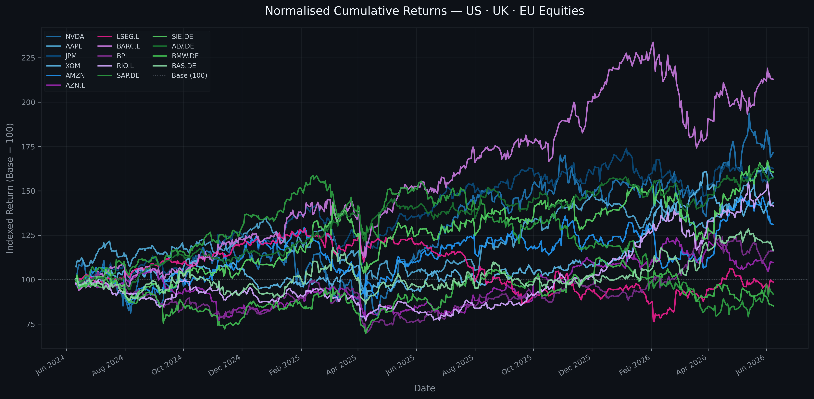
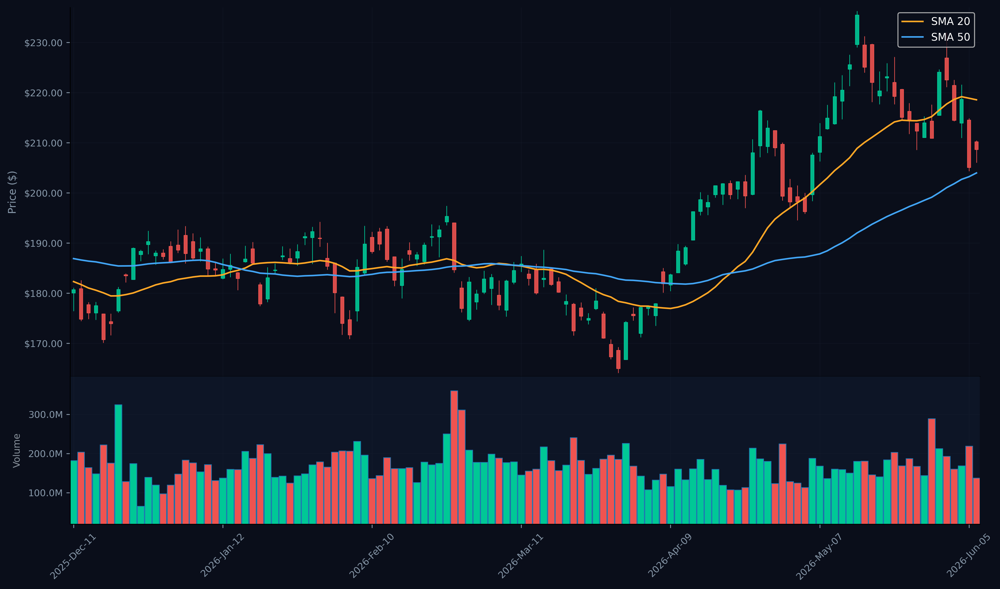
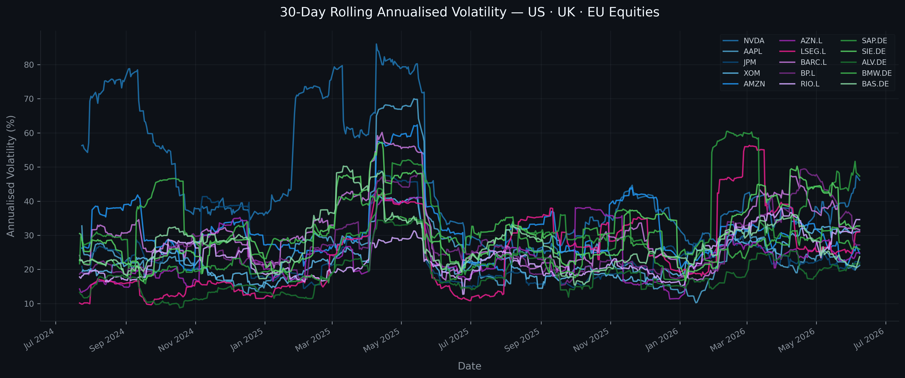
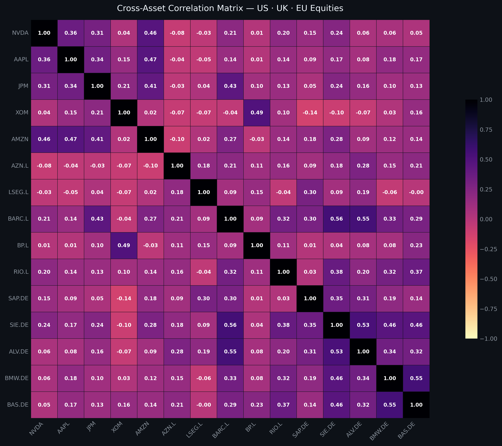

# Investment Operations Dashboard

A production-style investment operations pipeline built in Python. Covers 15 equities across NYSE/NASDAQ, the London Stock Exchange, and XETRA/DAX simultaneously. The system ingests live market data, calculates nine standard financial metrics, runs automated reconciliation checks that mirror the real daily workflow of an investment operations team, and outputs a self-contained HTML report with Bloomberg-inspired charts.

Built to reflect how investment operations functions actually work — not just data visualisation, but the full ops lifecycle: data governance, quality control, audit trails, and structured reporting.

---

## Screenshots

### Normalised Cumulative Returns — 15 Equities Across NYSE · LSE · XETRA


### NVDA — OHLCV Candlestick · SMA 20 & SMA 50 · Last 6 Months


### 30-Day Rolling Annualised Volatility — July 2024 Onwards


### Cross-Asset Correlation Matrix — US · UK · EU Equities


---

## Stock Universe

| Exchange | Tickers |
|---|---|
| NYSE / NASDAQ | NVDA, AAPL, JPM, XOM, AMZN |
| London Stock Exchange | AZN.L, LSEG.L, BARC.L, BP.L, RIO.L |
| XETRA / DAX | SAP.DE, SIE.DE, ALV.DE, BMW.DE, BAS.DE |

Changing the universe requires editing three lines in `config.py`. Everything else — analytics, reconciliation, charts, reports — adapts automatically.

---

## Stack

| Library | Role |
|---|---|
| `pandas` | Time series manipulation, rolling calculations, return series |
| `numpy` | Volatility annualisation, statistical calculations |
| `matplotlib` | All chart rendering — candlestick, volatility, cumulative returns |
| `mplfinance` | OHLCV candlestick charts with Bloomberg-inspired custom styling |
| `seaborn` | Cross-asset correlation heatmap |
| `SQLite` | Local data store — prices, fetch log, reconciliation log |
| `yfinance` | Primary live market data source |
| `Alpha Vantage` | Fallback data source with exponential backoff retry logic |
| `pandas-market-calendars` | Exchange-specific holiday calendars for accurate reconciliation |
| `python-dotenv` | API key management — secrets never enter the codebase |
| `zoneinfo` | London timezone handling — BST/GMT auto-detection |

---

## Architecture

```
config.py           — single source of truth for all constants and tickers
    │
    ├── data_fetcher.py     — live API ingestion with retry and fallback
    ├── database.py         — SQLite store: prices, fetch log, recon log
    ├── analytics.py        — nine financial metrics, fully stateless
    ├── reconciliation.py   — three automated data quality checks
    ├── visualisation.py    — five Bloomberg-inspired professional charts
    ├── report_generator.py — self-contained HTML report with embedded charts
    └── main.py             — CLI pipeline orchestrator
```

The pipeline runs in strict sequence: fetch → store → calculate → reconcile → chart → report. Each module is fully independent — analytics never touches the API, reconciliation never touches charts. Clean separation by design.

---

## Pipeline Stages

### 1. Data Ingestion — `data_fetcher.py`

Fetches OHLCV price data from yfinance for all 15 tickers. On any failure, automatically retries with exponential backoff (2s, 4s, 8s) before falling back to Alpha Vantage. All timestamps normalised to UTC on ingest to prevent timezone-related data corruption.

The pipeline never fetches data it already has. Each run queries the database first and only calls the API for dates genuinely absent. This is the core efficiency mechanism — subsequent runs are fast because only new trading days are ever fetched.

```bash
python src/main.py                 # standard run
python src/main.py --refresh       # force full API pull
python src/main.py --ticker NVDA   # single ticker
```

---

### 2. Database Layer — `database.py`

Three-table SQLite schema modelled on real investment ops data infrastructure:

**`prices`** — one row per ticker per trading day. `PRIMARY KEY (ticker, date)` enforces data integrity at database level. Duplicate records are physically impossible — no defensive code needed anywhere else.

**`fetch_log`** — every API call permanently recorded with source, timestamp, and row count. Any price in the database is fully traceable to its origin. This is how production ops teams govern data lineage.

**`reconciliation_log`** — every quality check logged as PASS, REVIEW, or BREAK with full detail. Mirrors how real ops teams document daily reconciliation work for internal audit and compliance.

---

### 3. Analytics Engine — `analytics.py`

Nine standalone financial metrics. Each function is pure — takes data in, returns a result, no side effects, no global state. Fully testable in isolation.

| Metric | Description |
|---|---|
| **Daily Returns** | Day-on-day percentage price change — the base unit of all downstream calculation |
| **Cumulative Returns** | Compounded return indexed to 100 at start date — standard institutional performance format enabling direct cross-asset comparison regardless of price level or currency |
| **Moving Averages** | 20-day and 50-day SMAs — standard institutional trend indicators. 20-day crossing above 50-day signals a bullish trend shift |
| **Rolling Volatility** | 30-day annualised volatility via `std × √252` — flags unusual price movements that may indicate data errors or unprocessed corporate actions before valuations run |
| **Sharpe Ratio** | Annualised risk-adjusted return benchmarked against the UK base rate. Above 1.0 is generally considered good. Negative means returns below risk-free |
| **Maximum Drawdown** | Worst peak-to-trough loss over the full period — standard risk metric in every client portfolio summary |
| **Correlation Matrix** | Cross-asset return correlations across all 15 tickers simultaneously — used in portfolio construction and diversification analysis |
| **VWAP** | Volume Weighted Average Price — standard execution quality benchmark used by trading desks. Significant deviation from VWAP triggers a performance shortfall investigation |
| **Annualised Return** | CAGR formula — expresses total return as a constant annual equivalent rate for fair comparison across periods of different length |

All volatility and return figures annualised using the globally accepted 252 trading days per year convention.

---

### 4. Reconciliation — `reconciliation.py`

Automates the three checks that define the morning workflow of a real investment operations team. Every check runs across all 15 tickers spanning three exchanges simultaneously. Results use a three-tier status system that mirrors how a real ops desk classifies findings:

| Status | Meaning |
|---|---|
| **PASS** | Data clean — no action required |
| **REVIEW** | Flagged for analyst sign-off — does not block valuations, but must be documented before reports are distributed |
| **BREAK** | Critical data issue — blocks NAV calculation, must be resolved before ops proceeds |

**Check 1 — Price Continuity** → PASS or BREAK

Compares dates held in the database against the expected trading calendar for each exchange, bounded dynamically to each ticker's actual stored date range. Days before data collection began are never flagged as missing — only genuine gaps within the stored period produce a BREAK. Exchange-specific holiday calendars applied automatically via `pandas-market-calendars` so genuine market closures (UK bank holidays, German public holidays, US federal holidays) never trigger false flags. A 3-day recency buffer accounts for T+1 settlement lag at the trailing edge.

**Check 2 — Return Outliers** → PASS or REVIEW

Flags any daily price move beyond ±5% for analyst review. In investment operations, moves of this magnitude almost always have an identifiable cause — earnings surprise, macro event, corporate action (stock split, special dividend, rights issue). These are REVIEW, not BREAK: the move may be entirely legitimate and already documented, but an analyst must confirm it before the day's valuation is signed off. High-volatility equities (NVDA, AMZN) will naturally produce REVIEW flags on earnings and macro days — this is expected behaviour, not a data error.

**Check 3 — Volume Anomalies** → PASS or REVIEW

Flags any day where volume exceeds 3 standard deviations from the 30-day rolling average. May indicate a data vendor error (duplicated feed, incorrect unit reporting) or a genuine market event (index inclusion, major news flow). Flagged as REVIEW — not a hard block, but must be investigated and documented before the day's data is considered clean for reporting.

All results logged to `reconciliation_log` as PASS, REVIEW, or BREAK with full detail — a permanent audit trail of every check run, matching how ops teams document daily recon for compliance purposes.

---

### 5. Visualisation — `visualisation.py`

Five charts rendered with a Bloomberg Terminal-inspired dark theme. Deep navy background (`#0a0e1a`), teal-green up candles (`#00c896`), red down candles (`#ef5350`), razor-thin grid lines. Saved to `outputs/charts/` at 300 DPI.

**Chart 1 — Normalised Cumulative Returns**
All 15 tickers indexed to 100 at the start date. Allows direct comparison between assets trading at very different price levels and denominated in different currencies. US (blue), UK (purple), EU (green) colour families make exchange groupings immediately identifiable.

**Chart 2 — OHLCV Candlestick with Volume**
Six-month OHLCV candlestick chart per ticker with 20-day (amber) and 50-day (blue) SMAs overlaid. Volume panel rendered below with clean M-suffix labels (e.g. `4.2M`). Currency symbols on price axis derived automatically from ticker suffix — `$` for US, `p` for LSE, `€` for XETRA.

**Chart 3 — 30-Day Rolling Annualised Volatility**
Short-term volatility window from July 2024 onwards. Used for daily ops monitoring — sudden spikes may indicate data feed errors or unprocessed corporate actions requiring immediate investigation.

**Chart 4 — 50-Day Rolling Annualised Volatility**
Longer-term volatility window showing structural trend rather than short-term spikes. Displayed alongside the 30-day chart for direct comparison.

**Chart 5 — Cross-Asset Correlation Heatmap**
15×15 symmetric correlation matrix across all tickers. Magma colourmap — dark purple for low/negative correlation, bright for high positive. Shows cross-market relationships and diversification effectiveness across US, UK, and EU assets simultaneously.

---

### 6. Report Generation — `report_generator.py`

Generates a fully self-contained HTML report on every pipeline run. All charts are base64-encoded and embedded directly — the file opens anywhere with no external dependencies. Saved to `outputs/reports/` with a timestamp.

Report includes: normalised cumulative returns chart, per-stock OHLCV panels, rolling volatility comparison, correlation heatmap, Sharpe ratio, annualised return, maximum drawdown, and full reconciliation results across all tickers. Timestamp displayed in London time — BST in summer, GMT in winter, switching automatically.

---

## Project Structure

```
InvestmentDashboard/
├── src/
│   ├── main.py               # CLI pipeline orchestrator
│   ├── config.py             # All constants — tickers, thresholds, paths
│   ├── data_fetcher.py       # Live market data ingestion
│   ├── database.py           # SQLite schema and queries
│   ├── analytics.py          # Nine financial metrics
│   ├── reconciliation.py     # Automated data quality checks
│   ├── visualisation.py      # Chart generation
│   └── report_generator.py   # HTML report output
├── data/                     # SQLite database (gitignored)
├── outputs/
│   ├── charts/               # Generated PNGs (gitignored)
│   └── reports/              # Generated HTML reports (gitignored)
├── requirements.txt
├── .env.example
└── .gitignore
```

---

## Setup

```bash
# 1. Clone
git clone https://github.com/anuojelade-stack/Investment-operations-dashboard.git
cd Investment-operations-dashboard

# 2. Install dependencies
pip install -r requirements.txt

# 3. Configure API key
cp .env.example .env
# Add your Alpha Vantage key to .env (yfinance requires no key)

# 4. Run
python src/main.py
```

---

## Key Design Decisions

**Database-first architecture** — the pipeline never fetches data it already has. Only genuinely missing dates trigger an API call. This mirrors how production ops systems are built — the database is the source of truth, not the API.

**Separation of concerns** — analytics never touches the API. Reconciliation never touches charts. Each module has one job. Adding a new metric or a new ticker requires changing exactly one file.

**Audit trail by default** — every API call and every reconciliation result is permanently logged. Nothing runs silently. This reflects the audit and governance requirements of real investment operations environments.

**Exchange-aware throughout** — holiday calendars, currency symbols, and colour coding are all derived automatically from the ticker suffix. The pipeline understands the difference between an LSE equity and a XETRA equity without any manual configuration.
